<div align="center">



<br/>

`🕹️ A SENIOR AI/ML ENGINEER HAS ENTERED THE GAME 🕹️`


</div>

<br/>

```text
╔══════════════════════════════════════════════════════════════════╗
║  SELECT YOUR ENGINEER                                            ║
║                                                                  ║
║  ▶ JORGE SANDOVAL                                                ║
║    Spec: LLMOps / RAG / Fine-tuning / Agent Architectures        ║
║    Passive ability: 15 yrs of DBA lore (Oracle, PostgreSQL...)   ║
║    Ultimate: ships ML to production, not just to notebooks       ║
╚══════════════════════════════════════════════════════════════════╝
```

## 🎮 Character Attributes

<div align="center">

</div>

## 🗺️ Quest Log

| Status | Quest | Loot |
|:------:|-------|------|
| ✅ | **Main Quest:** Build & deploy end-to-end LLM systems — RAG, fine-tuning (QLoRA/DPO/GRPO), multi-agent orchestration | Production XP |
| ✅ | **Dungeon cleared:** Implemented LLM post-training (CPT → SFT → DPO → GRPO) from scratch in pure PyTorch | Deep understanding +100 |
| ✅ | **Boss defeated:** 15 years as Relational DBA (Oracle, DB2, SQL Server, PostgreSQL, MySQL) | WIS +20 |
| ✅ | **Side quest:** Published research on ensemble learning & energy forecasting | 📜 Scrolls of Science |
| ✅ | **Guild leadership:** Former Deputy Secretary of Science, Technology & Innovation (Santa Catarina, Brazil) | CHA +15 |
| 🔄 | **Daily quest:** Building MCP servers, agentic tooling & voice-driven dev workflows | In progress... |

## ⚔️ Inventory

<div align="center">


</div>

## 🏆 Achievements Unlocked

```text
 🏅 PhD COMPLETIONIST ......... Ph.D. in Industrial & Systems Engineering
 🏅 ARCANE SCHOLAR ............ M.Sc. in Applied Computing (AI)
 🏅 FULL STACK OF DATA ........ DBA → Data Scientist → ML Engineer evolution line
 🏅 PUBLISHED AUTHOR .......... Peer-reviewed papers on ML & forecasting
 🏅 KNOWLEDGE SHARER .......... University professor & 18+ technical articles
 🏅 PUBLIC SERVANT ............ Government tech leadership
```

## 🐍 The Snake Devours My Contributions

<div align="center">
<picture>
  <source media="(prefers-color-scheme: dark)" srcset="https://raw.githubusercontent.com/jorgesandoval/jorgesandoval/output/snake-dark.svg"/>
  
</picture>
</div>

## 📊 High Scores

<div align="center">
<table>
  <tr>
    <td></td>
    <td></td>
  </tr>
</table>
</div>

## 🪙 Insert Coin to Connect

<div align="center">

```text
        ┌─────────────────────────────────────┐
        │   CONTINUE?   10 ... 9 ... 8 ...    │
        └─────────────────────────────────────┘
```

[](https://www.linkedin.com/in/jorge-g-sandoval/)
[](https://github.com/jorgesandoval)

*Always up for co-op mode: new ideas, projects, or the latest in AI engineering.*

`GAME SAVED. THANKS FOR PLAYING. ⭐`

</div>